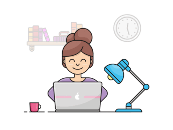

  

<h2 align="center">Hi 👋, I'm Minneh Kamau</h2>

<h4 align="center">Software Engineer and a UI/UX Designer</h4>

Goal-oriented and highly motivated , Fast self learner, Good team player, Time and task management, Strong communication skills, Solid technical expertise. A graduate from Moringa School and WomenTechStars Africa.

  

 

### Connect with Me:

<h3 align="left">Support:</h3>

<!--
**minnehkamau/minnehkamau** is a ✨ _special_ ✨ repository because its `README.md` (this file) appears on your GitHub profile.

Here are some ideas to get you started:

- 🔭 I’m currently working as a a full stack software engineer, developing web applications using modern technologies such as React, JavaScript, and Ruby on Rails....
- 👯 I’m looking to collaborate on upc ...
- 🤔 I’m looking for help with ...
- 💬 Ask me about ...
- 📫 How to reach me: ...
- 😄 Pronouns: ...
- ⚡ Fun fact: ...
-->
